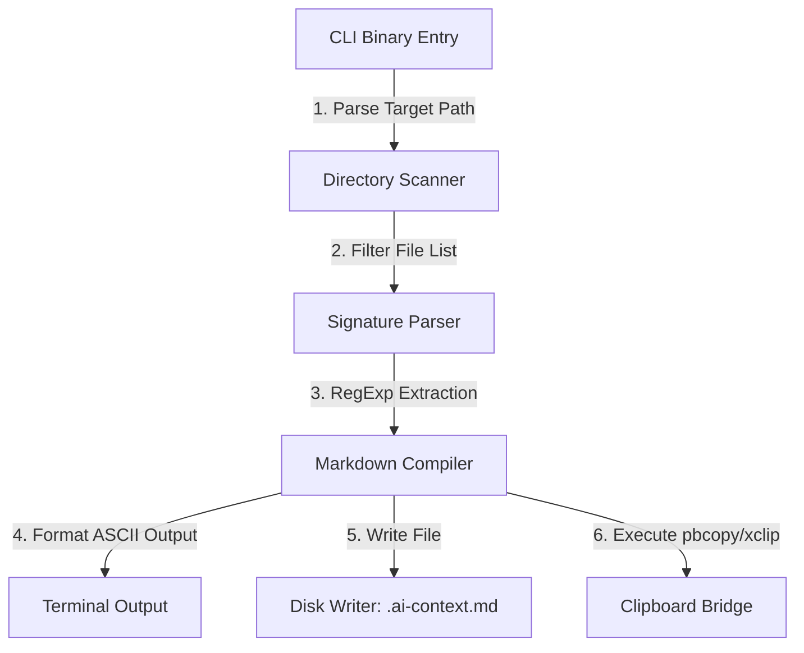

# Contextify — Engineering Design Doc

**Author:** TBD  
**Status:** Draft v0.1  
**Last updated:** 2026-06-21  
**Reviewers:** TBD  

---

## 1. Summary

Contextify is a command-line utility built in Node.js that scans a target directory, extracts exported JavaScript and TypeScript function signatures and JSDocs, and compiles them into a token-optimized markdown snapshot. This snapshot is automatically copied to the user's system clipboard and written to a `.ai-context.md` file. 

The primary engineering challenge is extracting clean TypeScript signatures and JSDoc blocks while discarding the code implementation bodies. We achieve this using a high-speed RegExp signature scanner with recursive bracket matching rather than loading the full TypeScript Compiler API, ensuring execution finishes in under 100ms.

## 2. Assumptions

- **Target scale:** Operated locally by individual developers on single code repositories. Designed for directories with <150 utility files.
- **Latency budget:** End-to-end execution (scan, parse, compile, copy) must complete in p95 <500ms.
- **Platform:** Cross-platform support for Node.js (v18+) running on macOS, Linux, and Windows (via WSL/PowerShell).
- **Cost ceiling:** $0 (fully local execution, zero external APIs or paid dependencies).
- **Out of scope:** Remote repository scanning, real-time file-watching daemons, multi-directory aggregation, and IDE extensions.

## 3. Goals & non-goals

**Goals (v1):**
- Recursively scan a specified directory, ignoring `node_modules` and files in `.gitignore`.
- Extract exported signatures (functions, constants, classes, interfaces, types) and their preceding JSDoc blocks.
- Strip all function execution bodies and internal logic to minimize token overhead.
- Copy the compiled markdown representation to the user's host clipboard.
- Write a persistent `.ai-context.md` file in the workspace root.
- Execute within <500ms on folders with up to 100 files.

**Non-goals (v1):**
- Modifying, refactoring, or linting the user's code files (read-only execution).
- Performing semantic analysis or checking for duplicate code logic.
- Maintaining a local state database or running a background indexing process.
- Scaling to scan large dependency folders (e.g. `node_modules` is excluded by default).

---

## 4. Architecture

Below is the component architecture and data flow of the CLI tool:



**What's here:**
- **CLI Entry (`bin/contextify.js`):** Parses command arguments, validates inputs, and triggers the core pipeline.
- **Directory Scanner (`lib/scanner.js`):** Recursively traverses the directory tree, respecting `.gitignore` rules.
- **Signature Parser (`lib/parser.js`):** Reads files, extracts export signatures, and strips implementation blocks.
- **Markdown Compiler (`lib/compiler.js`):** Formats output into a token-optimized layout and computes saved tokens.
- **Clipboard Bridge (`lib/clipboard.js`):** Platform-specific wrapper executing shell clipboard utilities.

**What's deliberately NOT here:**
- **No TS Compiler Host:** Using TypeScript's official parser adds ~800ms of startup latency. We replace it with regex parsing.
- **No Central Server / DB:** All data processing occurs entirely in-memory and outputs locally.

---

## 5. Key components

### CLI Entry (`bin/contextify.js`)
- **Responsibility:** Handles CLI execution.
- **Tech choice:** Plain Node.js `process.argv` (no heavy dependencies like Commander.js to keep startup fast).
- **Interface:** Evaluates terminal commands: `contextify <directory-path> [--no-file]`.

### Directory Scanner (`lib/scanner.js`)
- **Responsibility:** Recursively lists all JS, TS, JSX, and TSX files in the target directory.
- **Tech choice:** Node.js `fs.promises` (native filesystem methods).
- **Interface:** `scanDirectory(targetPath: string, ignorePatterns: string[]): Promise<string[]>`

### Signature Parser (`lib/parser.js`)
- **Responsibility:** Extracts JSDoc comments and exports, stripping out implementation details.
- **Tech choice:** JavaScript Regular Expressions with recursive bracket balancing.
- **Interface:** `parseFile(filePath: string): Promise<ScannedFile>`

### Clipboard Bridge (`lib/clipboard.js`)
- **Responsibility:** Writes the compiled string to the OS clipboard.
- **Tech choice:** Node `child_process.exec` invoking native OS commands (`pbcopy` on macOS, `xclip`/`xsel` on Linux, `clip` on Windows).
- **Interface:** `copyToClipboard(text: string): Promise<boolean>`

---

## 6. Data model

### Internal TypeScript Types

```typescript
export type ExportedSignature = {
  name: string;
  type: 'function' | 'const' | 'class' | 'interface' | 'type';
  signature: string;  // Complete signature definition
  jsdoc?: string;     // Parsed JSDoc block
};

export type ScannedFile = {
  filepath: string;
  exports: ExportedSignature[];
};
```

---

## 7. API surface

Since this is an offline CLI tool, we define the main internal module boundary calls:

### `parseFile(filePath: string): Promise<ScannedFile>`
- **Input:** Absolute path to a source file.
- **Output:** Parsed signatures or empty list if no exports exist.
- **Latency budget:** <15ms per file.

### `copyToClipboard(text: string): Promise<boolean>`
- **Input:** Markdown context string.
- **Output:** Returns `true` if execution succeeded, `false` otherwise.
- **Latency budget:** <100ms.

---

## 8. Key trade-offs (with rejected alternatives)

### Decision: Regex Bracket Parsing vs. Full TypeScript AST Compiler
- **Chose:** RegExp-based signature extraction.
- **Considered:** TypeScript Compiler API.
- **Why we picked this:** Loading the TypeScript Compiler API requires importing massive node packages, adding ~1 second of cold-start latency. Using optimized regex patterns combined with simple bracket-counting state machines allows us to strip function bodies in under 10ms per file, guaranteeing the CLI completes in under 200ms overall. We trade off 100% edge-case parsing accuracy for a 10x improvement in tool velocity.

### Decision: Child Process Clipboard Execution vs. Native Clipboard Bindings
- **Chose:** Calling OS-native clipboard utilities (`pbcopy`, `xclip`, `clip`).
- **Considered:** Installing native NPM bindings (e.g. `clipboardy`).
- **Why we picked this:** Native bindings compile binary objects during installation, which frequently fails on developer machines with differing node versions. Shell execution has zero installation dependencies and is highly robust.

---

## 9. Risks & unknowns

- **OS Clipboard Access Denied:** In strict corporate environments, child-process shell calls to clipboard commands can be blocked.  
  *Mitigation:* The tool will check the exit code of the copy process. If it fails, the CLI will output a yellow warning and direct the user to copy directly from the generated `.ai-context.md` file.
- **File Encoding Anomalies:** Codebases using legacy or non-UTF-8 character encodings could crash the regex parser.  
  *Mitigation:* Enforce `utf-8` file reading and catch all reading errors, logging them cleanly in the console.

---

## 10. Testing strategy

We use **Vitest** as our test runner. Tests are written in the `__tests__/` directory.

### Unit tests (must have):
- `lib/parser.js` -> `stripFunctionBody()`
  - *Behavior verified:* Given a string containing a function with nested loops and conditional braces, verify it strips the body correctly (leaving only parameters and return statement).
- `lib/parser.js` -> `extractExports()`
  - *Behavior verified:* Given a TS source string with mixed exports (`export const`, `export default function`, `export interface`), verify it returns the correct names, types, and JSDoc blocks.
- `lib/compiler.js` -> `generateASCIIBreakdown()`
  - *Behavior verified:* Given a list of scanned files, verify it builds a properly formatted tree output matching ANSI character specifications.

### Integration tests (one per happy path):
- **Happy Path Integration Flow:**
  - Execute CLI command pointing to a mock codebase directory.
  - *Verify:* Program exits with code `0`, a `.ai-context.md` file is created containing signatures, and the output is successfully copied (mocked at the clipboard command execution level).
- **Error Handled Flow:**
  - Execute CLI command pointing to a non-existent directory path.
  - *Verify:* Program exits with code `1` and prints the error message `✘ Error: Directory does not exist` to stderr.

### Deliberately not tested:
- **Actual OS clipboard memory state:** Testing whether the OS clipboard actually contains the pasted string is not checked inside automated tests, as it requires platform-specific screen/desktop access hooks. We mock the child-process bridge calls.
- **Terminal Visual Colors:** We do not verify ANSI escape code color rendering inside tests.

---

## 11. Rollout & monitoring

- **Rollout:** Publish as a private NPM package to the internal registry, collect feedback from 5 team members, then publish publicly.
- **Monitoring:** Local execution means we collect no telemetry. Success is monitored via user satisfaction surveys.

## 12. Cost & capacity

- **Per-user cost:** $0.
- **Monthly budget:** $0.
- **10× Scale Bottleneck:** Scanning folders with >1,000 files will block the single Node.js execution thread during RegExp parsing. Since this is an off-scope size, we will add an early exit constraint in v1 if the scanner detects more than 300 files.

## 13. Open questions

- [ ] Will `clip.exe` execute reliably in modern Windows Subsystem for Linux (WSL) environments? (Needs validation by developer).

## 14. Out of scope (will not do)

- **No automated refactoring:** Never write or modify files in the target folder.
- **No background service daemon:** No running state in background to watch file edits.
