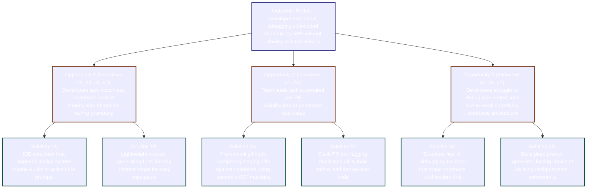

# Opportunity Solution Tree — Vibe-Coding Debt Mitigation

**Status:** Completed  
**Last updated:** 2026-06-21  
**Scope:** MMDT Course Artifact (Week 2 -> Week 3 transition)

---

## 1. High-Level Outcome

> **Outcome:** Reduce team developer time spent debugging and refactoring vibe-coded helper functions and shortcuts by 50% within 90 days, without slowing down feature release velocity.

---

## 2. Opportunity Solution Tree (OST) Visual

---

## 3. Detail of Nodes (Constraint Checklist Respected)

### Opportunity 1: Developers lack frictionless codebase context sharing with AI models during prompting.
*   **Source Evidence:** Surfaced by **Junior Developer #2** (who assumes the AI knows the codebase automatically), **Mid-level Engineer #3** (who notes searching for utilities is high friction), **Lead Developer #6** (who notes proper instructions and skills are rarely provided upfront), and **Junior Developer #7** (who prompts AI to build layout components from scratch under pressure).
*   **Solution 1A: Context-Injecting IDE Extension**
    *   *Description:* An editor plugin (VS Code/Cursor) that listens to active file editing and automatically appends signatures of relevant helper functions and design tokens to outgoing LLM prompts.
    *   *Impact:* Removes the manual searching and copy-pasting friction, ensuring AI always works with existing utilities.
*   **Solution 1B: LLM-Friendly `.context` Generator CLI**
    *   *Description:* A lightweight command-line tool that developer teams run locally to compile their `src/utils` and design system definitions into a single, highly compressed markdown file (e.g. `.ai-context.md`) optimized for LLM token ingestion.
    *   *Impact:* Enables copy-pasting context in one action without exposing large source files.

### Opportunity 2: Team leads lack automated pre-PR visibility into AI-generated duplicates.
*   **Source Evidence:** Surfaced by **Tech Lead #1** (who spends hours refactoring duplicates during manual code reviews) and **Engineering Manager #4** (who notes the team relies on basic formatting linters but has no semantic checkers for logic overlap).
*   **Solution 2A: Semantic/AST Pre-Commit Git Hook**
    *   *Description:* A git commit hook that runs on staged code, parses functions into an Abstract Syntax Tree (AST), and compares them against existing code signatures. If it finds a >80% similarity threshold, it warns the developer before pushing.
    *   *Impact:* Intercepts duplicates at the developer's keyboard before they ever reach a Pull Request.
*   **Solution 2B: Slack PR Duplicate Auditing Bot**
    *   *Description:* A GitHub webhook integration that analyzes incoming PR diffs using a lightweight LLM agent and comments on the PR with suggestions (e.g. *"This date parser in lines 24–40 looks identical to `src/utils/date.ts:parseISO()`. Consider refactoring."*).
    *   *Impact:* Empowers tech leads to review PRs with pre-computed reuse suggestions, reducing cognitive load.

### Opportunity 3: Developers struggle to resolve vibe-coded debugging issues due to weak underlying project architecture.
*   **Source Evidence:** Surfaced by **Contractor #5** (who spent a day fixing production bugs due to weak timezone handling structures), **Lead Developer #6** (who stated that debugging AI code takes a day instead of hours when design systems and folder structures are weak), and **Junior Developer #7** (who spent 6 hours alignment debugging because the project lacked a unified layout system).
*   **Solution 3A: "Structure-First" AI Debugging Assistant**
    *   *Description:* A custom developer chat agent that, before suggesting a code fix, runs a codebase dependency analysis and forces the model to explain how its proposed fix maps to the project's folder layout and system design.
    *   *Impact:* Prevents the AI from proposing isolated, ad-hoc bug fixes that violate project design.
*   **Solution 3B: Component-First Boilerplate Prompt Generator**
    *   *Description:* An interactive web tool that developers must use to generate boilerplate layout prompts. It forces the developer to select which existing layout containers, utility files, or theme settings they want to build upon, then compiles a strict prompt instruction set for the AI model.
    *   *Impact:* Prevents developers from prompting AI to build new components from absolute scratch.

---

## 4. Impact / Effort 2×2 Solution Categorization

We categorize the six solutions identified in the Opportunity Solution Tree based on their implementation effort and expected business/workflow impact.

| Impact / Effort | Low Effort | High Effort |
| :--- | :--- | :--- |
| **High Impact** | **Build this first ★** • *Solution 1B: LLM-Friendly `.context` CLI Generator* | **Plan for later** • *Solution 1A: Context-Injecting IDE Extension* • *Solution 3A: "Structure-First" AI Debugging Assistant* |
| **Low Impact** | **Quick win, low priority** • *Solution 2B: Slack PR Duplicate Auditing Bot* • *Solution 3B: Component-First Boilerplate Prompt Generator* | **Avoid** • *Solution 2A: Semantic/AST Pre-Commit Git Hook* |

### Rationale:

1. **Build this first ★ (High Impact / Low Effort)**
   * **Solution 1B (.context CLI):** Creating a script to scrape and format local `src/utils` files is trivial to implement (takes less than a day of scripting) but has immediate high value by letting developers feed their AI models with the exact codebase context they need.

2. **Plan for later (High Impact / High Effort)**
   * **Solution 1A (IDE Extension):** Directly embeds codebase context inside the prompt workflow, which has massive impact. However, building, maintaining, and distributing a VS Code/Cursor plugin requires high engineering effort.
   * **Solution 3A ("Structure-First" Debugger):** Deeply addresses the root cause of long debugging cycles in weak structures. Indexing structures and writing multi-step reasoning loops is highly impactful but requires complex LLM orchestration.

3. **Quick win, low priority (Low Impact / Low Effort)**
   * **Solution 2B (PR Slack Bot):** Easy to implement using GitHub webhooks and a basic LLM API call. However, it operates downstream (at the PR review phase), which means developers have already wasted time writing the duplicate code and waiting for review feedback.
   * **Solution 3B (Prompt Boilerplate Web Tool):** A simple static web page with dropdowns that generates text templates. Low effort, but relies entirely on manual developer compliance, which typically drops off during tight deadlines.

4. **Avoid (Low Impact / High Effort)**
   * **Solution 2A (AST Git Hook):** Building custom AST parsers and similarity algorithms that run locally is technically complex (high effort) and introduces high workflow friction. Developers will likely bypass it if it slows down their commits or returns false positives.

